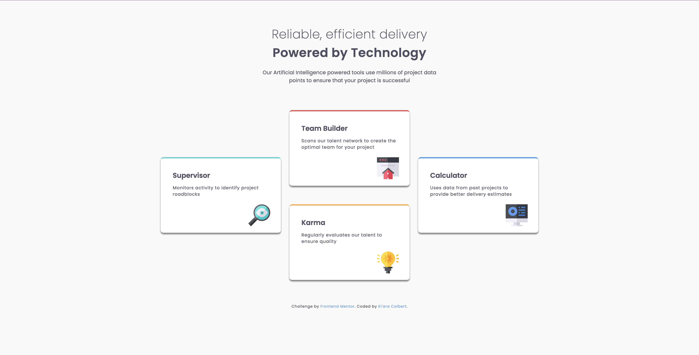

# Frontend Mentor - Four card feature section solution

This is a solution to the [Four card feature section challenge on Frontend Mentor](https://www.frontendmentor.io/challenges/four-card-feature-section-weK1eFYK). Frontend Mentor challenges help you improve your coding skills by building realistic projects. 

## Table of contents

- [Overview](#overview)
  - [The challenge](#the-challenge)
  - [Screenshot](#screenshot)
  - [Links](#links)
- [My process](#my-process)
  - [Built with](#built-with)
  - [What I learned](#what-i-learned)
  - [Continued development](#continued-development)
  - [Useful resources](#useful-resources)
- [Author](#author)

## Overview

### The challenge

Users should be able to:

- View the optimal layout for the site depending on their device's screen size

### Screenshot

### Links

- Solution URL: [View on Frontend Mentor](https://www.frontendmentor.io/solutions/four-card-feature-section-htmlcss--8Zt6ww5Ug)
- Live Site URL: [View via GitHub Pages](https://kiaraaa123.github.io/four-card-feature-section/)

## My process

### Built with

- Semantic HTML5 markup
- CSS custom properties
- Flexbox
- CSS Grid
- Media queries

### What I learned

This challenge was a great opportunity for me to continue practicing my responsive design skills. 

### Continued development

I will continue improving my ability to read design files and build responsive sites.

### Useful resources

- [W3 Schools Pixels to EM Converter](https://www.w3schools.com/tags/ref_pxtoemconversion.asp) - This resources was very helpful as I converted the sizes in the design files into a responsive format.

## Author

- Website - [Ki'ara Colbert](https://www.kiaracolbert.com)
- LinkedIn - [@kiaramontgomery](https://www.linkedin.com/in/kiaramontgomery/)
- GitHub - [@kiaraaa123](https://github.com/kiaraaa123)
- Frontend Mentor - [@kiaraaa123](https://www.frontendmentor.io/profile/kiaraaa123)